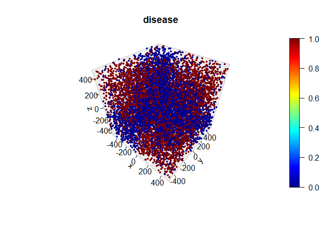
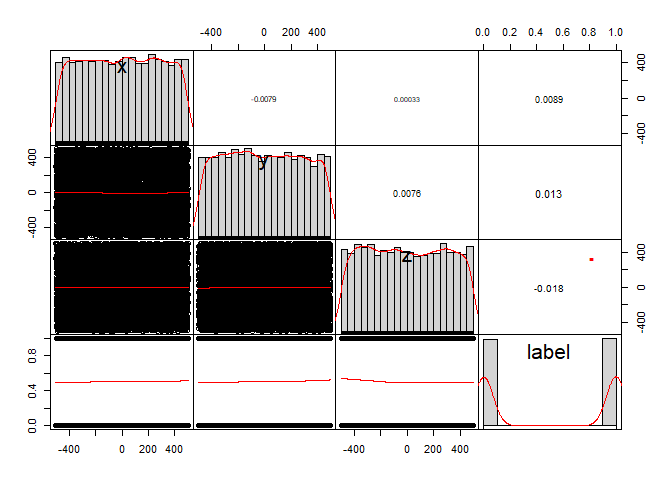
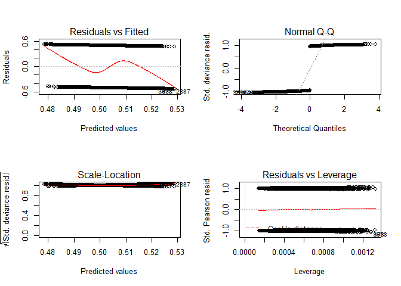
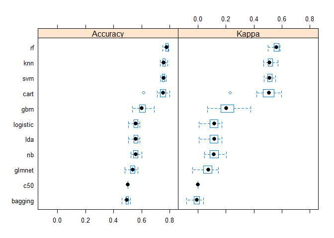
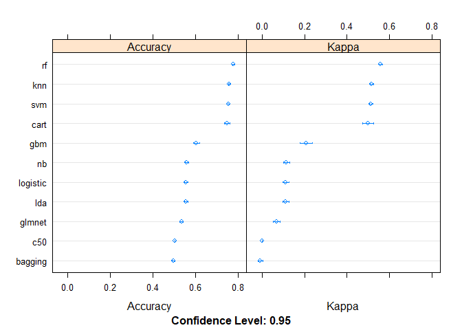

The Problem
-----------

1 - Build a classification problem, using the columns x, y and z, trying to classify the label column.

1.  Segregate a test and training frame.
2.  Use a GLM or Logistic Regression model and show the results.
3.  Use other method of your choice to handle the problem
4.  Compare and comment the results on the models used from b) and c)

### Step 0: Data Explotation

In this section, we'll see what the data looks like.

#### Look the spread data

In other hand we show you bellow a graphic we the data in 3D. It is not a good idea bacause 3D graphics, normaly, can't revel much more than numbers. If you look in detail, you'll see a little separetion in red against blue wich are the label of classes. All the data are visible mixed on , this show us that regression will fail, but let's to try to get the statistics numbers before any conclusion.

#### Looking for correlation between variables

We try to see any correlation between all variable. The graphs below show us this relationship.

 As shown, there is no relationship between any variables. Values are below the weak correlation. Other view or analyse is the distribution of the data, all variable (x, y and z) have a uniform distribution.

Step 1 - Answering the first question
-------------------------------------

On this step we are using Logistic Regression model to try classification the dataset about *label* variable.

Like the problem ask, we try to a simple method like split dataset with 70% for train and 30% to test using glm algorithm.

#### summarize results

    ## Confusion Matrix and Statistics
    ## 
    ##           Reference
    ## Prediction    0    1
    ##          0  635  458
    ##          1  865 1042
    ##                                          
    ##                Accuracy : 0.559          
    ##                  95% CI : (0.541, 0.5769)
    ##     No Information Rate : 0.5            
    ##     P-Value [Acc > NIR] : 5.513e-11      
    ##                                          
    ##                   Kappa : 0.118          
    ##  Mcnemar's Test P-Value : < 2.2e-16      
    ##                                          
    ##             Sensitivity : 0.4233         
    ##             Specificity : 0.6947         
    ##          Pos Pred Value : 0.5810         
    ##          Neg Pred Value : 0.5464         
    ##              Prevalence : 0.5000         
    ##          Detection Rate : 0.2117         
    ##    Detection Prevalence : 0.3643         
    ##       Balanced Accuracy : 0.5590         
    ##                                          
    ##        'Positive' Class : 0              
    ## 

The accuracy is 0.559, not so good because it's closer to a draw or a coin toss. We are in a 95% confidence interval, that means between 0.541, 0.5769.

#### Looking for Multicollinearity

In statistics, multicollinearity (also collinearity) is a phenomenon in which one predictor variable in a multiple regression model can be linearly predicted from the others with a substantial degree of accuracy. In this situation the coefficient estimates of the multiple regression may change erratically in response to small changes in the model or the data. Multicollinearity does not reduce the predictive power or reliability of the model as a whole, at least within the sample data set; it only affects calculations regarding individual predictors. That is, a multivariate regression model with collinear predictors can indicate how well the entire bundle of predictors predicts the outcome variable, but it may not give valid results about any individual predictor, or about which predictors are redundant with respect to others.

    ##        x        y        z 
    ## 1.000087 1.000107 1.000043

All values are near to one, it is good or expected.

#### Residual Analysis

The difference between the observed value of the dependent variable (*y*) and the predicted value (*ŷ*) is called the residual (*e*). Each data point has one residual.

Residual = Observed value - Predicted value *e* = *y* − *ŷ*

Both the sum and the mean of the residuals are equal to zero. That is, *Σ**e* = 0 and *e* = 0.

Step 2
------

We will try to have more control over the computational nuances of the training and test function, both the number of folds and the number of resampling iterations are equal to 10. Only for repeated cross-validation in k-fold: the number of complete sets of folds for compute it 3. This is more efficient than we have tried so far.

*We will use 10 other algorithms besides logistic regression.*

Different from split dataset in training and test , we'll to use cross validation.

**Cross-validation**, sometimes called rotation estimation, or out-of-sample testing is any of various similar model validation techniques for assessing how the results of a statistical analysis will generalize to an independent data set. It is mainly used in settings where the goal is prediction, and one wants to estimate how accurately a predictive model will perform in practice.

### Other attempts with other algorithms

We'll try, again, Logistic Regression using this technique (k-fold) to get better results.

**Logistic regression** is a classification algorithm traditionally limited to only two-class classification problems. In this case we have no more than two classes (labels), but we'll use the Linear Discriminant Analysis to compare to linear classification technique.

**GLMNET** Extremely efficient procedures for fitting the entire lasso or elastic-net regularization path for linear regression, logistic and multinomial regression models, Poisson regression and the Cox model.

**SVM Radial** Support vector machines are a famous and a very strong classification technique which does not use any sort of probabilistic model like any other classifier but simply generates hyperplanes or simply putting lines, to separate and classify the data in some feature space into different regions.

**kNN** - k-nearest neighbors algorithm In pattern recognition, the k-nearest neighbors algorithm (k-NN) is a non-parametric method used for classification and regression.

**Naive Bayes** The Naive Bayes Classifier technique is based on the so-called Bayesian theorem and is particularly suited when the dimensionality of the inputs is high.

**Decision Trees** are commonly used in data mining with the objective of creating a model that predicts the value of a target (or dependent variable) based on the values of several input (or independent variables).

**CART** The CART or Classification & Regression Trees methodology was introduced in 1984 by Leo Breiman, Jerome Friedman, Richard Olshen and Charles Stone as an umbrella term to refer to the following types of decision trees.

**C5.0** Is an algorithm used to generate a decision tree developed by Ross Quinlan

**Bagged CART** Bagging ensemble algorithm and the Random Forest algorithm for predictive modeling.

**Random Forest** Random forests or random decision forests are an ensemble learning method for classification, regression and other tasks that operates by constructing a multitude of decision trees at training time and outputting the class that is the mode of the classes (classification) or mean prediction (regression) of the individual trees

**Stochastic Gradient Boosting** (Generalized Boosted Modeling) Gradient boosting is a machine learning technique for regression and classification problems, which produces a prediction model in the form of an ensemble of weak prediction models, typically decision trees.

### Final considerations

**Accuracy**

Scientists evaluate experimental results for both precision and accuracy, and in most fields, it's common to express accuracy as a percentage.

**KAPPA**

Cohen's kappa coefficient (κ) is a statistic which measures inter-rater agreement for qualitative (categorical) items. It is generally thought to be a more robust measure than simple percent agreement calculation, as κ takes into account the possibility of the agreement occurring by chance.

### Table comparison

    ## 
    ## Call:
    ## summary.resamples(object = results)
    ## 
    ## Models: lda, logistic, glmnet, svm, knn, nb, cart, c50, bagging, rf, gbm 
    ## Number of resamples: 30 
    ## 
    ## Accuracy 
    ##               Min.   1st Qu.    Median      Mean   3rd Qu.      Max. NA's
    ## lda      0.5050000 0.5436364 0.5595000 0.5559015 0.5713214 0.5860000    0
    ## logistic 0.5050000 0.5436364 0.5595000 0.5560016 0.5713214 0.5860000    0
    ## glmnet   0.4810000 0.5207600 0.5385000 0.5347662 0.5505253 0.5734266    0
    ## svm      0.7352647 0.7482500 0.7559998 0.7561025 0.7642500 0.7762238    0
    ## knn      0.7340000 0.7500000 0.7560008 0.7581017 0.7671746 0.7850000    0
    ## nb       0.5234765 0.5429069 0.5572793 0.5580324 0.5733571 0.6020000    0
    ## cart     0.6153846 0.7335165 0.7538784 0.7496713 0.7712500 0.7987988    0
    ## c50      0.5020000 0.5024975 0.5025025 0.5027000 0.5030000 0.5030000    0
    ## bagging  0.4600000 0.4878774 0.4967482 0.4963341 0.5057540 0.5205205    0
    ## rf       0.7500000 0.7726937 0.7798899 0.7787015 0.7888029 0.7937938    0
    ## gbm      0.5344655 0.5827911 0.6023013 0.6039413 0.6277500 0.6886887    0
    ## 
    ## Kappa 
    ##                  Min.     1st Qu.       Median         Mean    3rd Qu.
    ## lda       0.008905832  0.08653155  0.118074991  0.111014410 0.14191830
    ## logistic  0.008905832  0.08655437  0.118074991  0.111215673 0.14191830
    ## glmnet   -0.039297043  0.04032343  0.075485054  0.068325506 0.09982274
    ## svm       0.470870078  0.49667670  0.512192226  0.512376299 0.52863707
    ## knn       0.467980847  0.50003300  0.512003973  0.516174500 0.53429744
    ## nb        0.046660171  0.08535088  0.114133600  0.115599546 0.14600631
    ## cart      0.229912298  0.46681255  0.507660445  0.499283751 0.54252307
    ## c50       0.000000000  0.00000000  0.000000000  0.000000000 0.00000000
    ## bagging  -0.079417115 -0.02410578 -0.006306092 -0.007216385 0.01135973
    ## rf        0.499945994  0.54534486  0.559780521  0.557386823 0.57758766
    ## gbm       0.068945007  0.16542377  0.204626885  0.207789907 0.25547771
    ##                Max. NA's
    ## lda      0.17105500    0
    ## logistic 0.17105500    0
    ## glmnet   0.14578325    0
    ## svm      0.55260606    0
    ## knn      0.56997936    0
    ## nb       0.20379936    0
    ## cart     0.59759961    0
    ## c50      0.00000000    0
    ## bagging  0.04085363    0
    ## rf       0.58751112    0
    ## gbm      0.37731810    0

We can see in the results of the above table that the best performance of 79.87% was of the algorithm **CART**, followed by **RF **with 79.60% and 78.87 for **SVM**.

The *Kappa* value was better in **RF** with 0.574 followed by **SVM** with 0.555 and **CART** with 0.542.

Since we use the cross-validation technique, we will choose the average of 30 attempts. This leads us to believe that **RF was better**, both in percentage and Kappa, with 77.85% and 0.561 respectively.

### Boxplot comparison

In descriptive statistics, a box plot or boxplot is a method for graphically depicting groups of numerical data through their quartiles. Box plots may also have lines extending vertically from the boxes (whiskers) indicating variability outside the upper and lower quartiles, hence the terms box-and-whisker plot and box-and-whisker diagram. Outliers may be plotted as individual points.

The boxplot chart corroborates the values mentioned in the table above with the best performance.

### Dot-plot comparison

The comparison of points follows the boxplot including the variation of the minimum and maximum from the average.

Conclusion
----------

The Random Forest (RF) algorithm for regression and classification has considerably gained popularity since its introduction in 2001. Meanwhile, it has grown to a standard classification approach competing with logistic regression in many innovation-friendly scientific fields.

In this context, we present a good scale benchmarking experiment based on one datasets comparing the prediction performance of the original version of RF with default parameters and Logistic Rregression as binary classification tools. Most importantly, the design of our benchmark experiment is inspired from clinical trial methodology, thus avoiding common pitfalls and major sources of biases.

**Random Forest** (RF) performed better than **Logistic Regression** (LR) according to the considered accuracy measured on the dataset. The mean difference between **RF** and **LR** was 0.22 percentual points for the accuracy, and 0.443 of Kappa, all measures thus suggesting a significantly better performance of **RF**. As a side-result of our benchmarking experiment, we observed that the results were noticeably dependent on the inclusion criteria used to select the example dataset (cross-validation against split dataset), thus emphasizing the importance of clear statements regarding this dataset selection process. We also stress that neutral studies similar to ours, based on a high number of datasets to training and test and carefully designed, will be necessary in the future to evaluate further variants, implementations or parameters of random forests which may yield improved accuracy compared to the original version with default values.

*Source*

Some explanatory texts, such as CART, RF among others were taken from the Internet (Wikipedia).
